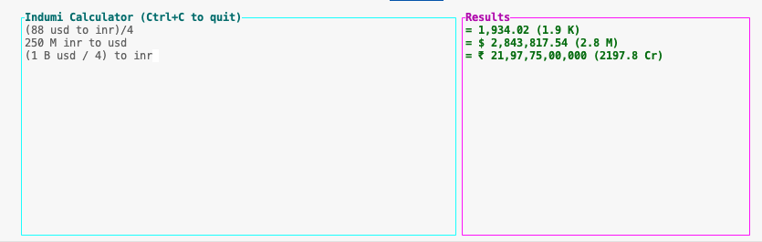

# Indumi Calculator

A terminal-based calculator with natural language calculations and currency conversion, inspired by Numi and Soulver 3.



## Features

- **Text editor interface** - Edit calculations like a text file
- **Live results** - See results on the right as you type
- **Variables** - Store and reuse values
- **Currency conversion** - Convert between USD, EUR, and INR with currency symbols
- **Text-based numbers** - Use "crore", "lakh", "million", "billion" in calculations
- **Human-readable estimates** - Large numbers show approximate value (e.g., "1 B", "5 Cr")
- **Mathematical operations** - Add, subtract, multiply, divide
- **Locale-aware formatting** - Indian numbering system (1,00,000) for INR, Western system (1,000) for USD/EUR

## Build & Run

```bash
cargo build
cargo run
```

Or run the binary directly:
```bash
./build/debug/indumi
```

## Testing

Indumi has a comprehensive test suite with 78+ automated tests:

```bash
cargo test                       # Run all tests
cargo test parser                # Run parser tests only
cargo test --test integration    # Run integration tests only
cargo test -- --nocapture        # Show test output
```

**Test coverage includes:**
- Parser (35 tests): Operator precedence, parentheses, currency parsing, error handling
- Calculator (26 tests): Expression evaluation, formatting, currency conversion
- Integration (17 tests): End-to-end scenarios, real-world calculations

## Usage

### Basic Math
```
100 + 50         → 150
2 - 1            → 1
100 * 5          → 500
1000 / 4         → 250
```

### Variables
```
coffee = 3.5
lunch = 12
total = coffee + lunch
```

### Currency Conversion
```
100 USD to INR        → ₹ 8,350 (8.4 K)
50 € to $             → $ 54.35
1000 INR to EUR       → € 10.99 (11 K)
10000000 INR to USD   → $ 119,760.48 (119.8 K)
```

### Text-based Numbers
```
1 crore INR to USD    → $ 119,760.48 (119.8 K)
2.5 lakh INR to USD   → $ 2,994.01 (3 K)
5 cr INR to EUR       → € 54,945.05 (54.9 K)
10 lac INR to $       → $ 11,976.05 (12 K)
5 million USD to INR  → ₹ 41,75,00,000 (4.2 Cr)
1.5 billion USD to €  → € 1,380,000,000 (1.4 B)
```

Supported units:
- **Indian**: crore/cr (1,00,00,000), lakh/lac (1,00,000), thousand (1,000)
- **Western**: billion (1,000,000,000), million (1,000,000), thousand (1,000)
- **Short**: k (1,000), m (1,000,000), b (1,000,000,000)

### Text-based Numbers in Calculations
```
1 b / 4          → 250,000,000 (250 M)
5 cr + 2 lakh    → 5,02,00,000 (5 Cr)
10 k * 3         → 30,000 (30 K)
2.5 m - 500 k    → 2,000,000 (2 M)
```

### Mixed Examples
```
salary = 5000
rent = 1500
savings = salary - rent
savings USD to INR
```

## Controls

- **Arrow keys** - Navigate cursor
- **Type** - Enter calculations
- **Enter** - New line
- **Backspace/Delete** - Edit text
- **Ctrl+C** - Quit

## Exchange Rates (Static)

- 1 USD = 83.50 INR
- 1 USD = 0.92 EUR
- 1 EUR = 90.76 INR

## Project Structure

```
src/
├── main.rs      - Entry point & event loop
├── editor.rs    - Text editor engine
├── parser.rs    - Expression parser
├── calc.rs      - Calculation engine
├── currency.rs  - Currency conversion
└── ui.rs        - TUI renderer
```

## Dependencies

- `ratatui` - Terminal UI framework
- `crossterm` - Terminal manipulation
- `regex` - Pattern matching

## Inspiration

This project was inspired by:

- **[Numi](https://numi.app/)** - Beautiful calculator app for macOS with natural language input
- **[Soulver 3](https://soulver.app/)** - Notepad calculator that makes math more intuitive and accessible
